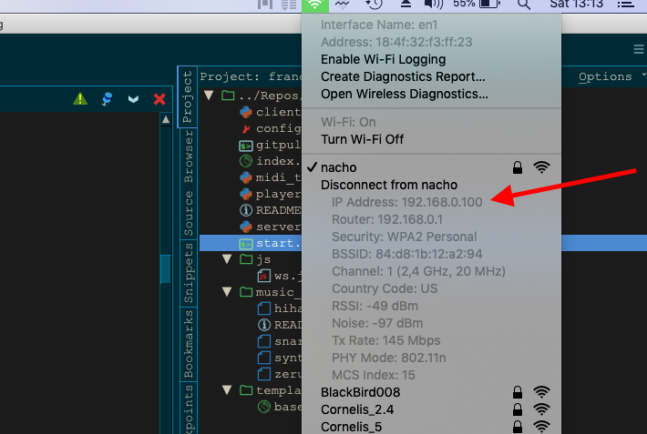
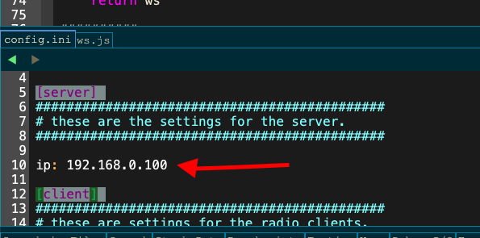

# Francesca Woodman Theater Performance

## Software for audio LAN installation with hacked retro alarm clocks and websockets ##

## requirements

python3

[https://www.python.org/downloads/](https://www.python.org/downloads/)

for midi input (so the server side)

`pip3 install mido`

maybe you will need this backend for mido too

`pip3 install python-rtmidi`

for websockets to communicate to the radios in LAN (for the server and the clients)

`pip3 install aiohttp`

for the web interface

`pip3 install aiohttp_jinja2`

for playing the music files

`pip3 install pygame`

after having installed the required python libraries you can run with

`python3 server.py` or `chmod +x` the file to make it executable.

The server will be listening to any incoming midi device that is connected (before boot). It will then broadcast certain commands depending on the incoming midi msg through websockets.

`python3 client.py` will launch a client that receives the command via websockets

## Web Interface ##
Once the server is booted visit

http://localhost:8080

on any browser to open the web interface to monitor and manage the alarm clocks.

## Soldering new alarm clocks ##
[Soldering readme](SOLDERING.md)/Users/matiasaskvik/Documents/GitHub/francesca/README.md

## Adding new music files to the alarm clocks and playing them ##
[Music readme](music_files/README.md)

## troubleshooting ##

#### the clients are not connecting to the server? ####
  - Make sure the laptop is connected to the router network. SSID is "nacho"
  - Make sure the performance router is ON and the computer running the server is connected to it
  - Make sure the computer running the server has no firewall blocking the connections
  - Make sure that the IP of the server is correct in the config.ini file:
    - first check your ip addres:
    
    - then make sure the config.ini file has the same ip you just checked:
    

#### A single radio is not connecting? ####
  - Once you spot which radio is not connecting you do 2 things.
  1. Turn the radio off and then on again. It should work.
  2. If the above doesn't work you can force it to connect manually. Do as follows:
    - Open the terminal and log in to the specific alarm clock (let's assume alarm clock 8 is the target):
    `ssh ubuntu@radio8.local`
    the type the password: francesca
    Once logged in type the following command:
    `sudo systemctl restart radio.service`
    Then radio8 will appear as connected in the web interface.
