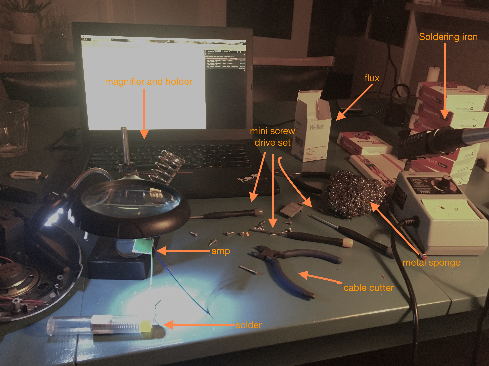
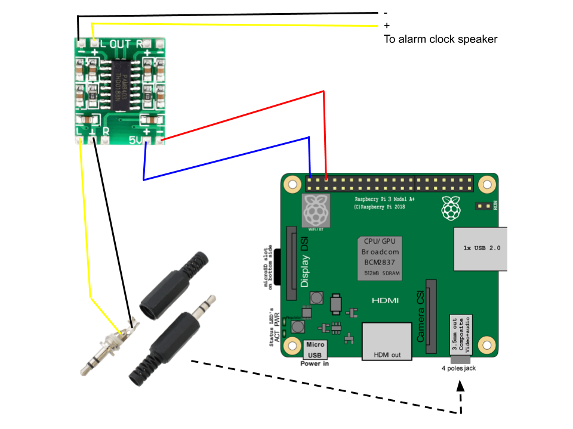

# Soldering Instrutions 

### To solder the components of each alarm clock you will need the following tools:

* Soldering iron with a good point. I prefer a flat angled point as the solder easily slides in place.
* Metal sponge for cleaning the soldering iron tip. I clean it after every little solder. 
* Set of Precision screwdrivers. This because some of the radios have tiny screws and sometimes strange heads. Like the star looking one.
* A magnifier glass, but specially a holder will save you lot's of time and effort.
* Cable cutter. Usefult to strip cables but also to cut the excess in the solder [see video](videos/soldercut.mp4).
* Soldering Flux.

### Soldering diagram
