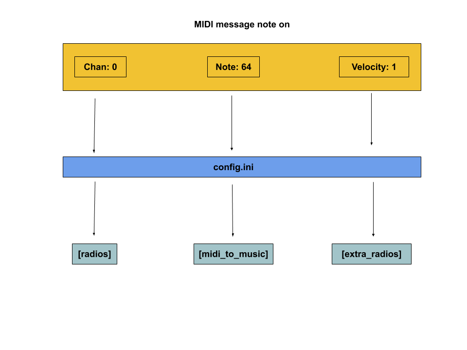

# MIDI guide #
To play new alarm clocks you have to send specific MIDI messages that the server will broadcast to the clients. The clients will read the config.ini file to know how to map the MIDI messages to specific music tracks.

### The incoming midi messages are mapped as follows:

This message would then:
- select the radio or radios at `0` in the [radios] section of the config.ini
- select the radios at `1` in the [extra_radios]
- select the music file at `64` in the [midi_to_music]

and then play the selected music file in the selected radios.

## special messages 
Every line in these sections of the config.ini can have one or more items, separeated by commas. So for example if we write 
in the section [extra_radios]:
`2: radio2, radio6, radio8`
the value at `2` would play in radios 2, 6 and 8.

## reserved messages 
TODO